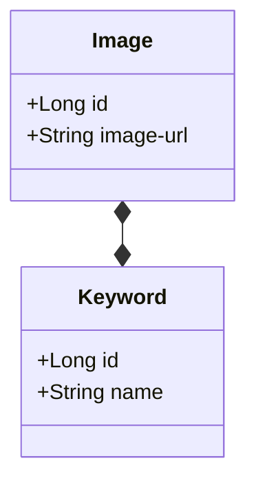

# Image Sorter API

## Função

A principal função da API é categorizar e organizar diferentes imagens, que são armazenadas de acordo com a sua URL,
as categorias dadas para cada imagem podem ser originadas tanto das palavras-chave contidas dentro dos metadados dela,
que ao cadastrar uma URL, esses dados são automaticamente extraídos e processados corretamente ou também podem ser
adicionadas posteriormente usando o ID da imagem cadastrada e a nova "keyword" que será associada à ela.

## Diagrama de Classes

